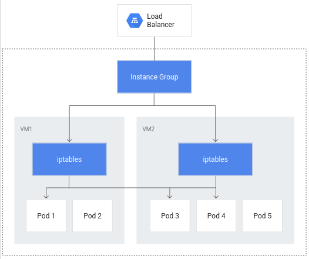
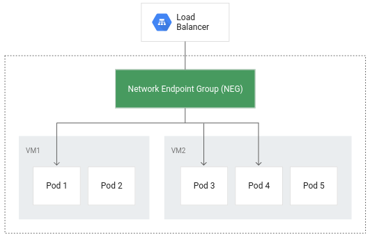

# GKE-Cluster-Management

Google Cloud Architecture: Design, Implementations, Optimizations and Management

---



---



---

## Overview

This playbook guides you through configuring and optimizing a Google Kubernetes Engine (GKE) cluster for both resource efficiency and high availability. You’ll create a container-native load balancer, perform load testing, configure liveness/readiness probes, and set up a Pod Disruption Budget. Following these steps will help ensure you only consume necessary resources, minimize unnecessary traffic, and maintain application uptime during maintenance or scaling events.

---

## Objectives

1. **Create a container-native load balancer through Ingress**
2. **Load test an application to determine resource requirements**
3. **Configure liveness and readiness probes for application health**
4. **Create a Pod Disruption Budget (PDB) to protect availability during disruptions**

---

## Prerequisites & Setup

### 1. Lab Account & Environment

1. **Use Temporary Lab Credentials**

   - Open an Incognito or Private browser window.
   - Click **Start Lab** and use the provided temporary username (e.g., `student-00-xxxxx@qwiklabs.net`) and password to sign into the Google Cloud Console.
   - Do **not** use your personal Google account.

2. **Activate Cloud Shell**

   - In the Cloud Console, click the **Activate Cloud Shell** icon (top right).
   - Accept the prompts to authorize.
   - Confirm the active project is `qwiklabs-gcp-04-xxxxx` by running:

     ```bash
     gcloud config list project
     ```

   - If needed, set the project manually:

     ```bash
     gcloud config set project qwiklabs-gcp-04-xxxxx
     ```

3. **Set Compute Zone**

   - Configure your default zone to `us-east1-d`:

     ```bash
     gcloud config set compute/zone us-east1-d
     ```

4. **Create a Three-Node GKE Cluster**

   - Ensure VPC-native (alias IP) is enabled to support container-native load balancing:

     ```bash
     gcloud container clusters create test-cluster \
       --num-nodes=3 \
       --enable-ip-alias
     ```

   - Wait until the cluster creation completes.

---

## Task 1. Container-Native Load Balancing Through Ingress

Container-native load balancing allows your HTTP(S) traffic to go directly to Pods (via NEGs), reducing network hops and improving performance.

### 1.1 Deploy a Single-Pod Application

1. **Create the Pod Manifest**
   In Cloud Shell, run:

   ```bash
   cat << EOF > gb_frontend_pod.yaml
   apiVersion: v1
   kind: Pod
   metadata:
     labels:
       app: gb-frontend
     name: gb-frontend
   spec:
       containers:
       - name: gb-frontend
         image: gcr.io/google-samples/gb-frontend-amd64:v5
         resources:
           requests:
             cpu: 100m
             memory: 256Mi
         ports:
         - containerPort: 80
   EOF
   ```

   - **Explanation**: This Pod runs the sample `gb-frontend` image, requests minimal CPU/memory, and exposes port 80.

2. **Apply the Pod Manifest**

   ```bash
   kubectl apply -f gb_frontend_pod.yaml
   ```

   - Wait \~1–2 minutes for the Pod to enter `Running` state.

### 1.2 Create a ClusterIP Service with NEG Annotation

1. **Create the Service Manifest**

   ```bash
   cat << EOF > gb_frontend_cluster_ip.yaml
   apiVersion: v1
   kind: Service
   metadata:
     name: gb-frontend-svc
     annotations:
       cloud.google.com/neg: '{"ingress": true}'
   spec:
     type: ClusterIP
     selector:
       app: gb-frontend
     ports:
     - port: 80
       protocol: TCP
       targetPort: 80
   EOF
   ```

   - **Explanation**:

     - `type: ClusterIP` exposes the Pod inside the cluster.
     - The annotation `cloud.google.com/neg: '{"ingress": true}'` ensures GKE will create a Network Endpoint Group (NEG) for direct Pod targeting once an Ingress is deployed.

2. **Apply the Service Manifest**

   ```bash
   kubectl apply -f gb_frontend_cluster_ip.yaml
   ```

   - Wait a minute for resource creation to propagate.

### 1.3 Create an Ingress Object

1. **Create the Ingress Manifest**

   ```bash
   cat << EOF > gb_frontend_ingress.yaml
   apiVersion: networking.k8s.io/v1
   kind: Ingress
   metadata:
     name: gb-frontend-ingress
   spec:
     defaultBackend:
       service:
         name: gb-frontend-svc
         port:
           number: 80
   EOF
   ```

   - **Explanation**:

     - This Ingress routes all HTTP traffic to the `gb-frontend-svc` Service on port 80.
     - When applied, GKE automatically provisions a Global HTTP(S) Load Balancer and attaches the previously created NEG.

2. **Apply the Ingress Manifest**

   ```bash
   kubectl apply -f gb_frontend_ingress.yaml
   ```

   - Wait 2–3 minutes for Google Cloud to provision the Load Balancer and assign an External IP.

### 1.4 Verify Backend Health

1. **Retrieve the Backend Service Name**

   ```bash
   BACKEND_SERVICE=$(gcloud compute backend-services list \
     --filter="NAME~gb-frontend" \
     --format="value(NAME)")
   ```

   - **Explanation**: Finds the Google Cloud Backend Service linked to your Ingress (its name contains `gb-frontend`).

2. **Check Backend Health Status**

   ```bash
   gcloud compute backend-services get-health "$BACKEND_SERVICE" --global
   ```

   - Repeat every minute until you see `healthState: HEALTHY` for each Pod.
   - **Explanation**: Google Cloud’s health check pings each Pod IP in the NEG to confirm they’re alive and serving traffic.

3. **Retrieve the Ingress External IP**

   ```bash
   kubectl get ingress gb-frontend-ingress
   ```

   - Note the `ADDRESS` column. Copy and open it in a browser to confirm the sample web app loads.

---

## Task 2. Load Testing an Application

Load testing identifies how many concurrent requests the app can handle, and what CPU/memory headroom remains. You’ll use Locust to simulate traffic.

### 2.1 Build & Deploy Locust

1. **Copy Locust Configuration Files**

   ```bash
   gsutil -m cp -r gs://spls/gsp769/locust-image .
   ```

   - **Explanation**: Downloads a directory containing a `Dockerfile`, Locust configuration, and test scripts.

2. **Build the Locust Docker Image**

   ```bash
   gcloud builds submit \
     --tag gcr.io/${GOOGLE_CLOUD_PROJECT}/locust-tasks:latest locust-image
   ```

   - **Explanation**: Pushes your Locust image to Container Registry so it can be pulled by GKE.

3. **Verify Container Image**

   ```bash
   gcloud container images list \
     --filter="locust-tasks" \
     --format="TABLE(NAME)"
   ```

   - Confirm `gcr.io/<PROJECT>/locust-tasks` appears in the list.

4. **Deploy Locust Main & Workers**

   - Copy the provided Kubernetes manifest for Locust:

     ```bash
     gsutil cp gs://spls/gsp769/locust_deploy_v2.yaml .
     ```

   - Substitute your project ID and apply:

     ```bash
     sed "s/\${GOOGLE_CLOUD_PROJECT}/$(gcloud config get-value project)/g" locust_deploy_v2.yaml \
       | kubectl apply -f -
     ```

   - **Explanation**:

     - Creates a `locust-main` Deployment (1 replica) and a `locust-worker` Deployment (5 replicas).
     - The `locust-main` Service is of type `LoadBalancer` to expose the Locust UI.

### 2.2 Access & Run Load Test

1. **Retrieve Locust Service External IP**

   ```bash
   kubectl get service locust-main
   ```

   - Wait for the `EXTERNAL-IP` to populate (it may initially show `<pending>`).

2. **Open the Locust UI**

   - In a separate browser tab, navigate to `http://<EXTERNAL-IP>:8089`.

3. **Run a Baseline Load Test**

   - In the Locust UI:

     - **Number of users**: `200`
     - **Hatch rate (users spawned/second)**: `20`
     - Click **Start Swarming**.

   - **Explanation**: Simulates 200 concurrent users ramping up at 20 users/sec, hitting your single GB frontend Pod.

4. **Monitor Pod Resource Utilization**

   - In Cloud Console, navigate to **Kubernetes Engine → Workloads**, then click the `gb-frontend` Pod.
   - Under the **Metrics** tab, expand the chart legend. Observe:

     - **CPU usage** (as a fraction of 100m request)
     - **Memory usage** (in MiB vs. the 256Mi request)

   - Note average and peak values. These inform appropriate CPU/memory requests and autoscaler settings.

### 2.3 Simulate a Traffic Spike

1. **Edit Locust Load Parameters**

   - In the Locust UI, click **Edit** under the status banner.

     - **Number of users**: `900`
     - **Hatch rate**: `300`

   - Click **Start Swarming** again.
   - **Explanation**: Quickly injects 700 additional users to see how the Pod’s CPU spikes and if it can sustain short bursts.

2. **Observe Pod Metrics**

   - Refresh the `gb-frontend` Pod metrics view. Expect CPU utilization to approach \~70% of the 100m request. Memory should remain around 80Mi–100Mi.
   - **Outcome**: Use these values to choose safe horizontal autoscaler thresholds (e.g., scale out when CPU hits 60–70%).

---

## Task 3. Readiness and Liveness Probes

Probes help Kubernetes determine when Pods are healthy and able (or not) to serve traffic. Liveness probes restart crashed applications; readiness probes only add Pods to Service endpoints when they’re ready.

### 3.1 Configure a Liveness Probe

1. **Create the Liveness Probe Pod Manifest**

   ```bash
   cat << EOF > liveness-demo.yaml
   apiVersion: v1
   kind: Pod
   metadata:
     labels:
       demo: liveness-probe
     name: liveness-demo-pod
   spec:
     containers:
     - name: liveness-demo-pod
       image: quay.io/centos/centos:stream9
       args:
       - /bin/sh
       - -c
       - touch /tmp/alive; sleep infinity
       livenessProbe:
         exec:
           command:
           - cat
           - /tmp/alive
         initialDelaySeconds: 5
         periodSeconds: 10
   EOF
   ```

   - **Explanation**:

     - On startup, the container creates `/tmp/alive` and then sleeps indefinitely.
     - Every 10 seconds (after a 5-second initial delay), Kubernetes runs `cat /tmp/alive`. If the file is missing, the probe fails and container restarts.

2. **Deploy the Liveness Demo Pod**

   ```bash
   kubectl apply -f liveness-demo.yaml
   ```

   - Wait a few seconds for the Pod to show up in `Running` state.

3. **Verify Initial Pod Events**

   ```bash
   kubectl describe pod liveness-demo-pod
   ```

   - Look under **Events** to confirm creation and startup events.

4. **Force a Liveness Failure**

   - Remove the file checked by the probe:

     ```bash
     kubectl exec liveness-demo-pod -- rm /tmp/alive
     ```

   - After \~10 seconds, describe the Pod again:

     ```bash
     kubectl describe pod liveness-demo-pod
     ```

   - Observe events like `Liveness probe failed: cat: /tmp/alive: No such file or directory` followed by a container restart.
   - **Explanation**: Validates that the liveness probe will restart a container when its internal health check fails.

### 3.2 Configure a Readiness Probe

1. **Create the Readiness Demo Pod & Service Manifest**

   ```bash
   cat << EOF > readiness-demo.yaml
   apiVersion: v1
   kind: Pod
   metadata:
     labels:
       demo: readiness-probe
     name: readiness-demo-pod
   spec:
     containers:
     - name: readiness-demo-pod
       image: nginx
       ports:
       - containerPort: 80
       readinessProbe:
         exec:
           command:
           - cat
           - /tmp/healthz
         initialDelaySeconds: 5
         periodSeconds: 5
   ---
   apiVersion: v1
   kind: Service
   metadata:
     name: readiness-demo-svc
     labels:
       demo: readiness-probe
   spec:
     type: LoadBalancer
     ports:
       - port: 80
         targetPort: 80
         protocol: TCP
     selector:
       demo: readiness-probe
   EOF
   ```

   - **Explanation**:

     - The Pod runs `nginx`, but readiness depends on `/tmp/healthz` existence.
     - The Service (type `LoadBalancer`) exposes the Pod externally but will only route traffic once readiness is `True`.

2. **Deploy the Readiness Demo Resources**

   ```bash
   kubectl apply -f readiness-demo.yaml
   ```

   - Wait for the Pod to initialize and for the Service to get an External IP (`kubectl get svc readiness-demo-svc`).

3. **Confirm No Traffic Initially**

   - Open a browser to `http://<EXTERNAL-IP>`. You should see a “site cannot be reached” error because the Pod is not yet ready.

4. **Inspect Pod Events to Confirm Readiness Failures**

   ```bash
   kubectl describe pod readiness-demo-pod
   ```

   - Under **Events**, look for repeated `Readiness probe failed: cat: /tmp/healthz: No such file or directory`.

5. **Create the Health File to Signal Readiness**

   ```bash
   kubectl exec readiness-demo-pod -- touch /tmp/healthz
   ```

   - Wait a few seconds, then run:

     ```bash
     kubectl describe pod readiness-demo-pod | grep -A 5 "^Conditions"
     ```

   - You should see `Ready   True` for both `ContainersReady` and `Ready`.

6. **Verify Application is Reachable**

   - Refresh `http://<EXTERNAL-IP>` in your browser. You should now see the default “Welcome to nginx!” page.

---

## Task 4. Pod Disruption Budget (PDB)

A Pod Disruption Budget ensures a minimum number of replicas remain available during voluntary disruptions (e.g., node draining, rolling updates).

### 4.1 Migrate to a Multi-Replica Deployment

1. **Delete the Single-Pod App**

   ```bash
   kubectl delete pod gb-frontend
   ```

2. **Create a Deployment Manifest with 5 Replicas**

   ```bash
   cat << EOF > gb_frontend_deployment.yaml
   apiVersion: apps/v1
   kind: Deployment
   metadata:
     name: gb-frontend
     labels:
       run: gb-frontend
   spec:
     replicas: 5
     selector:
       matchLabels:
         run: gb-frontend
     template:
       metadata:
         labels:
           run: gb-frontend
       spec:
         containers:
           - name: gb-frontend
             image: gcr.io/google-samples/gb-frontend-amd64:v5
             resources:
               requests:
                 cpu: 100m
                 memory: 128Mi
             ports:
               - containerPort: 80
                 protocol: TCP
   EOF
   ```

   - **Changes vs. single Pod**:

     - `replicas: 5`
     - Reduced memory request from `256Mi` to `128Mi` to reflect likely usage from load testing.

3. **Deploy the 5-Replica Deployment**

   ```bash
   kubectl apply -f gb_frontend_deployment.yaml
   ```

   - Wait until all 5 Pods become `Running` and `Ready`.

4. **Verify Deployment Status**

   ```bash
   kubectl describe deployment gb-frontend | grep "^Replicas"
   ```

   - You should see:

     ```
     Replicas: 5 desired | 5 updated | 5 total | 5 available | 0 unavailable
     ```

### 4.2 Observe Behavior Without a PDB

1. **Drain All Nodes Sequentially (No PDB Present)**

   ```bash
   for node in $(kubectl get nodes -l cloud.google.com/gke-nodepool=default-pool -o name); do
     kubectl drain --force --ignore-daemonsets --grace-period=10 "$node"
   done
   ```

   - **Explanation**: This command cordons and evicts pods from each node. Because there is no PDB, all 5 replicas can be evicted at once, leaving zero available.

2. **Check Deployment Availability**

   ```bash
   kubectl describe deployment gb-frontend | grep "^Replicas"
   ```

   - You may see:

     ```
     Replicas: 5 desired | 5 updated | 5 total | 0 available | 5 unavailable
     ```

   - **Outcome**: Application is down until GKE schedules replicas elsewhere.

3. **Uncordon All Nodes**

   ```bash
   for node in $(kubectl get nodes -l cloud.google.com/gke-nodepool=default-pool -o name); do
     kubectl uncordon "$node"
   done
   ```

   - Wait for Pods to reschedule; verify `Replicas` shows `5 available`.

### 4.3 Create a Pod Disruption Budget

1. **Define the PDB**

   ```bash
   kubectl create poddisruptionbudget gb-pdb \
     --selector=run=gb-frontend \
     --min-available=4
   ```

   - **Explanation**:

     - Ensures at least 4 of 5 replicas remain available during voluntary disruptions.
     - You could also use `--max-unavailable=1` (same effect in this case).

2. **Inspect the PDB**

   ```bash
   kubectl get poddisruptionbudget gb-pdb
   ```

   - You should see:

     ```
     NAME    MIN AVAILABLE    MAX UNAVAILABLE    ALLOWED DISRUPTIONS    AGE
     gb-pdb  4                 N/A                1                     <timestamp>
     ```

### 4.4 Observe Behavior with PDB in Place

1. **Drain All Nodes Again**

   ```bash
   for node in $(kubectl get nodes -l cloud.google.com/gke-nodepool=default-pool -o name); do
     kubectl drain --timeout=30s --ignore-daemonsets --grace-period=10 "$node"
   done
   ```

   - **Explanation**: Kubelet will attempt to evict Pods, but once only 4 replicas remain, further eviction will be blocked by the PDB.

2. **Review Drain Output**

   - You will see messages like:

     ```
     evicting pod default/gb-frontend-<pod-id-1>
     evicting pod default/gb-frontend-<pod-id-2>
     evicting pod default/gb-frontend-<pod-id-3>
     evicting pod default/gb-frontend-<pod-id-4>
     error when evicting pod "gb-frontend-<pod-id-5>": Cannot evict pod as it would violate the pod's disruption budget.
     ```

   - **Explanation**: Only 1 Pod (from 5) can be taken down; the fifth Pod will not be evicted until another Pod becomes available.

3. **Check Deployment Availability**

   ```bash
   kubectl describe deployment gb-frontend | grep "^Replicas"
   ```

   - You should see:

     ```
     Replicas: 5 desired | 5 updated | 5 total | 4 available | 1 unavailable
     ```

   - **Outcome**: Four replicas remain serving traffic until the cluster can reschedule the fifth.

4. **Stop the Drain Loop**

   - Press `CTRL+C` to exit the drain command loop once you observe the PDB in action.

---

## Cleanup (Optional)

If you want to remove all resources created during this lab:

1. **Delete the PodDisruptionBudget**

   ```bash
   kubectl delete poddisruptionbudget gb-pdb
   ```

2. **Delete Deployments & Services**

   ```bash
   kubectl delete deployment gb-frontend locust-main locust-worker
   kubectl delete service gb-frontend-svc readiness-demo-svc locust-main
   kubectl delete ingress gb-frontend-ingress
   ```

3. **Delete Demo Pods**

   ```bash
   kubectl delete pod liveness-demo-pod readiness-demo-pod
   ```

4. **Delete Cluster**

   ```bash
   gcloud container clusters delete test-cluster --quiet
   ```

---

## Conclusion

By following this playbook, you have demonstrated how to:

- **Provision a VPC-native GKE cluster** with alias IPs.
- **Deploy a simple web application** as a single Pod.
- **Configure a Container-Native Load Balancer** using a ClusterIP Service annotated with a NEG and an Ingress.
- **Perform load testing with Locust** to measure CPU and memory utilization and understand your application’s capacity.
- **Set up Liveness and Readiness Probes** to automatically restart unhealthy containers and ensure Pods only receive traffic when ready.
- **Establish a Pod Disruption Budget** to guarantee minimum availability during voluntary disruptions (e.g., draining nodes).

These strategies collectively optimize resource consumption, minimize extraneous network hops, and protect application uptime—key pillars of cost-efficient, highly available GKE workloads.
